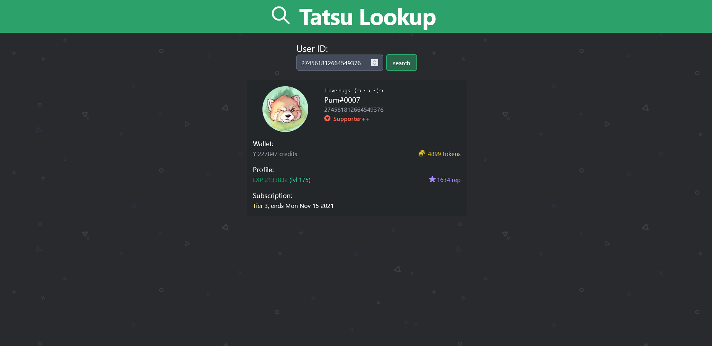

# Tatsu-Lookup

A website to interact with the Tatsu API to find out information about a user.

## Features

- Statically rendered Websites 
- Shareable links
- Informative and user-friendly interface

## Setup

1. Download the source code

2. Create a tatsu API Key with the `t!apikey create` command

3. Set up the .env file:

   ```
   TATSU_KEY="XXXX" // your tatsu api key
   ```

4. It's suggested to host this service on [Vercel](https://vercel.com/) to automatically support the serverless functions

## Images

- ##### User Profile

  

- ##### Discord Embed

  

## Planned Features

- [ ] Show the stats in the embed
- [ ] Replace the current way of showing EXP with a progress bar